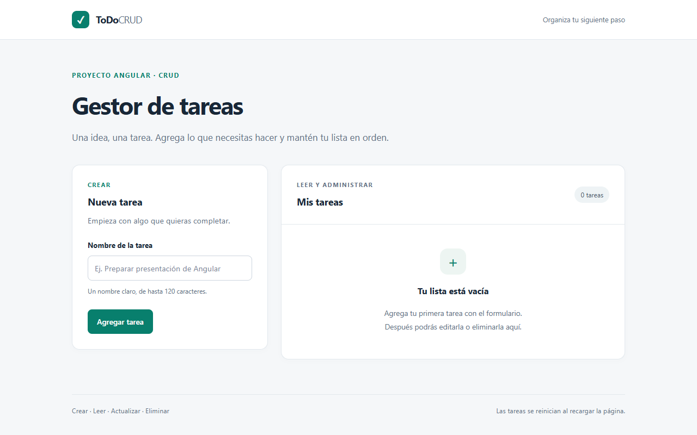
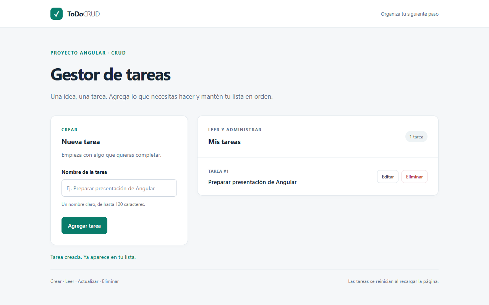
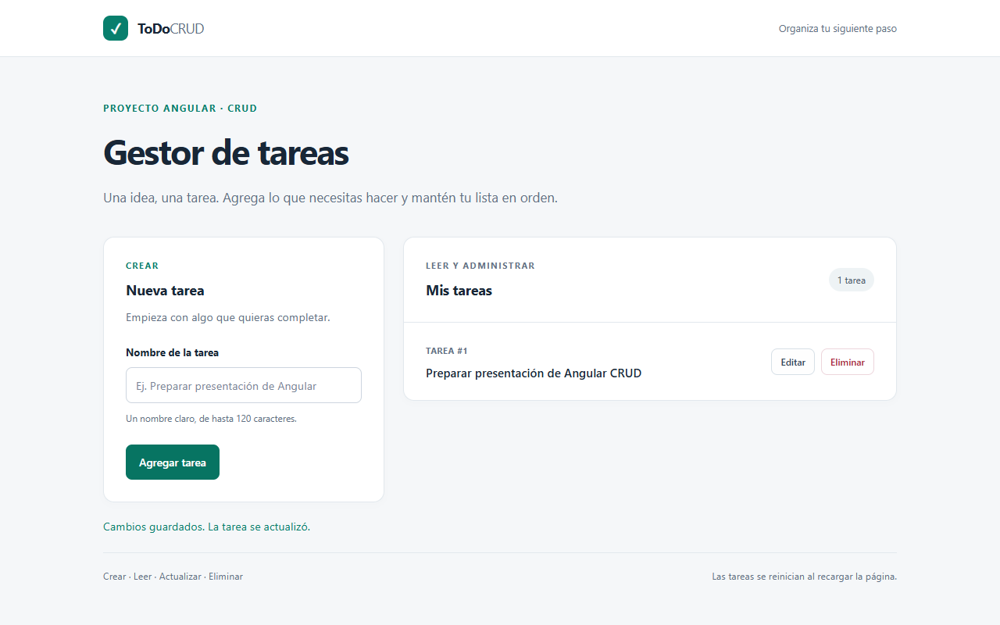
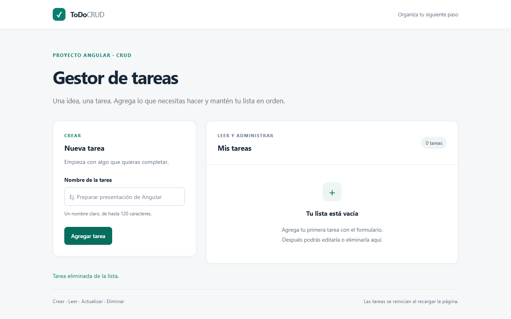

# ToDoCRUD — Gestor de tareas

Aplicación en Angular que demuestra las cuatro funciones básicas solicitadas:

> «Demuestra el uso de las funciones básicas del Framework: a) Crear elemento b) Leer elemento c) Actualizar elemento d) Eliminar elemento».

## Ejecutar el proyecto

Con Node.js y npm instalados, abre una terminal en la raíz del repositorio:

```bash
npm ci
npm start
```

Abre http://localhost:4200/ en el navegador. Para detener el servidor, pulsa `Ctrl+C` en la terminal.

## Comprobar los requisitos

| Requisito           | Acción en la interfaz                                              | Resultado que se muestra                                                |
| ------------------- | ------------------------------------------------------------------ | ----------------------------------------------------------------------- |
| Crear elemento      | Escribir un nombre y pulsar **Agregar tarea**.                     | La nueva tarea aparece en **Mis tareas**.                               |
| Leer elemento       | Consultar **Mis tareas**.                                          | Se muestran los nombres de las tareas registradas y la cantidad actual. |
| Actualizar elemento | Pulsar **Editar**, cambiar el nombre y pulsar **Guardar cambios**. | La misma tarea muestra el nombre actualizado, sin crear otra fila.      |
| Eliminar elemento   | Pulsar **Eliminar** en una tarea.                                  | La tarea desaparece de la lista y la cantidad disminuye.                |

El nombre debe contener texto y admite hasta 120 caracteres. Se eliminan los espacios sobrantes al principio y al final. **Cancelar** abandona la edición sin modificar la tarea.

## Demostración de 2–3 minutos

1. **Presentar el objetivo.** Mostrar **Gestor de tareas** y explicar: «Esta aplicación usa Angular para crear, consultar, actualizar y eliminar tareas».
2. **Crear.** En **Nombre de la tarea**, escribir `Preparar presentación de Angular` y pulsar **Agregar tarea**. Señalar la nueva fila y la cantidad de tareas.
3. **Leer.** Mostrar **Mis tareas** y explicar que la lista permite consultar los elementos registrados.
4. **Actualizar.** Pulsar **Editar**, cambiar el nombre a `Preparar presentación de Angular CRUD` y pulsar **Guardar cambios**. Mostrar que se actualizó la misma fila y la cantidad no cambió.
5. **Eliminar.** Pulsar **Eliminar**. Mostrar que desapareció la fila y que la lista indica **Tu lista está vacía**.
6. **Explicar Angular.** «Los componentes muestran el formulario y la lista. Un servicio compartido conserva las tareas; las señales actualizan la pantalla cuando cambia la colección».

Como comprobación adicional, intentar agregar un nombre vacío o compuesto únicamente por espacios: no debe aparecer una tarea nueva. Para demostrar **Cancelar**, crear otra tarea, editar su nombre y cancelar; el nombre original debe conservarse.

## Evidencia de la demostración

Estas capturas muestran una secuencia realizada sobre la aplicación en ejecución con Chrome sin interfaz (headless), con datos de ejemplo.

**1. Estado inicial:** la lista no contiene tareas.



**2. Crear y leer:** la tarea aparece en la lista y el contador indica un elemento.



**3. Actualizar:** el nombre cambia; el identificador y la cantidad de tareas se conservan.



**4. Eliminar:** la tarea desaparece y el contador vuelve a cero.



## Organización del código

- `App`: reúne el formulario y la lista, y coordina la edición.
- `TaskForm`: captura el nombre, valida la entrada y permite agregar, guardar o cancelar.
- `TaskList`: muestra la colección y el estado de lista vacía.
- `Task` (componente): muestra una tarea con los botones **Editar** y **Eliminar**.
- `Task` (servicio): conserva elementos `{ id, title }`, expone una señal de tareas de solo lectura y proporciona las operaciones para agregar, actualizar y eliminar.

El formulario usa `FormsModule` y `ngModel`; la lista usa `@for` con identificadores estables. Los componentes se comunican mediante entradas y salidas, y el servicio se obtiene con la inyección de dependencias de Angular.

Las tareas se guardan **en memoria** y se pierden al recargar la página. La consigna proporcionada no exige persistencia, un servidor de datos ni una base de datos.

## Verificación reproducible

Desde la raíz del repositorio:

```bash
npm test -- --watch=false
npm run build
```

Las pruebas comprueban el comportamiento de las operaciones y su integración con la interfaz. La compilación comprueba que Angular puede generar la aplicación. La demostración en el navegador permite mostrar al docente el resultado visible de los cuatro requisitos.

Verificación realizada el 3 de octubre de 2026:

- 13 pruebas aprobadas en 6 archivos.
- Compilación de producción y prerenderizado completados sin advertencias.
- Flujo crear → leer → actualizar → eliminar verificado en Chrome headless, sin errores de consola.
- Validación de nombres vacíos, cancelación de edición y reinicio al recargar comprobados.
- Vista móvil de 390 píxeles comprobada sin desbordamiento horizontal, incluso con un nombre de 120 caracteres.
